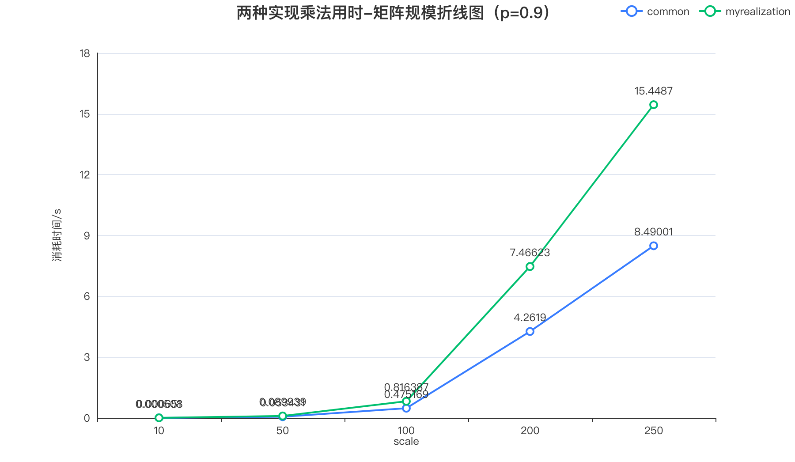
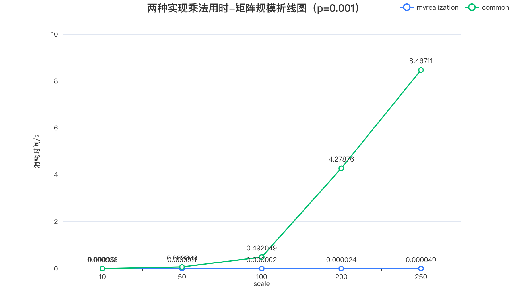
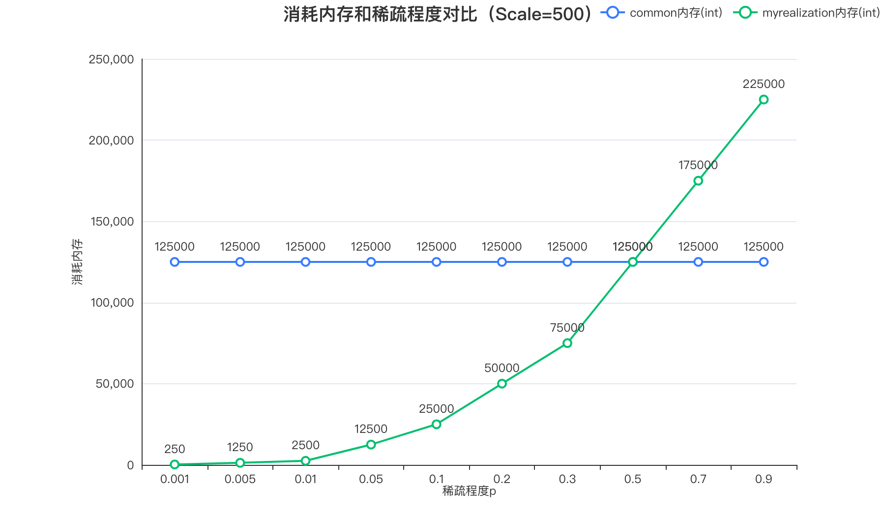

## Lab0 稀疏矩阵的乘法

> 在本实验中，你需要通过某些更高效的数据结构存储稀疏矩阵，并正确实现稀疏矩阵的乘法运算。

[TOC]

### 稀疏矩阵的存储

实验给出的是通过文件读写一个矩阵的数据，那么就很好说了。我们只需要按照格式读取稀疏矩阵的信息，然后再进行转换即可。

- 首先，必要存储矩阵的行、列信息
- 然后我们需要存那些地方是非0的信息，比如一个$100\times100$的矩阵，但是只有$a_{1,2}=4$，其余元素全部是$0$，那我们就没有必要存储那么多信息，我们只需要存储$1,2,4$，即可。这时，我选择`map`这种数据结构很好的解决了问题。
- 显然数组是二维的，肯定不能用一维的`map`来处理问题，我们需要一个二维的`map`来解决。我画了一个示意图，如下所示（使用阿里/语雀绘制）


我们来解释一下这个图：

- 假如我们要存储一个$a_{i,j}$，只需要先根据$i$行数找到对应的行容器（没有的话就创建一个），然后再在列容器里面存储对应的值。
- 假如我们要查询一个$a_{3,4}$，只需要根据$3$找到行容器，再在列容器里面找到对应`key==4`的值。
- 假如我们要获取某一行的所有值，那很简单，把对应的行容器取出来即可
- 假如我要获取某一列的呢？那就不好办了，我的做法是牺牲空间换时间，再开辟一个完全一样的二维`map`容器，只不过这次是先列、后行。

有了解释，我下面的代码也不难看懂了，两个`map`刚刚已经解释过了。补充一个`elementAddNum`函数的用途：他的作用是接收$(X,Y,value)$，然后$a_{x,y} = a_{x,y} + value$，待会再来解释这个的意义。

```cpp
class SparseMatrix {
private:
  int _row;
  int _col;

  /* TODO: Add any necessary data structure here. */
  /* Map from row to col to Matrix Value */
  std::map<int, std::map<int, int> > rowColMap;
  /* Map from col to row to Matrix Value */
  std::map<int, std::map<int, int> > colRowMap;

public:
  SparseMatrix() = default;

  SparseMatrix(const std::string input_file);

  void to_file(const std::string output_file);

  SparseMatrix operator*(const SparseMatrix &right);

  // x is row, y is col, num means array[x][y] += num; 
  void elementAddNum(int rowIndex, int colIndex, int num);

  void setRowNum(int rowNum);
  void setColNum(int colNum);
};
```

### 稀疏矩阵的乘法

直接解释我的思路可能不好理解，那我们举个例子($A_{m\times n},B_{n\times p}$)。
$$
result = A \times B
$$
还是我上面放的那张图，不难看出，图里面可以推断出：
$$
a_{0,2}=3,a_{0,4}=5
$$
也就是说，我们知道第0行只有两个元素不为0，其余的都是0，OK，那我们去看 $B$ 矩阵的什么呢，第2行，第4行。假如 $B$ 矩阵的 $b_{2,K} = 4$，那我们需要：$result_{0,K} =result_{0,K} + a_{0,2} \times b_{2,K} $（初始化的时候全部为0）

你可能有些懵，那我还是从矩阵乘法的本质入手，假设我要计算$result[0][K]$，$K$是个常数：
$$
result[0][K]= \sum^{n-1}_{i=0}a[0][i]\times b[i][K]
$$
这显然人人都看得懂，因为这是矩阵乘法定义，我就不多说了，但是由于矩阵是个稀疏的，也就是可以说，上面的那个求和的，很多项其实是$0$。

我们为什么要找第$0$行的非零元素呢，因为一旦第0行某个元素是0，上面那个求和公式里面对应的项，一定就是0了。所以我们要找非0的，假设非0的是2,4，那我们就缩小了范围，去$B$矩阵的第二行找非0的，假如找到了$k_1$，那我们就可以肯定$result[0][k1]$中，一定有一份**贡献**来自于：$a[0][2]\times b[2][k_1]$，至于还有没有别的贡献（比如$a[0][4]\times b[4][k_1]$），要靠**后面的扫描B矩阵第四行才能知道。**

这样就解决了问题，上代码（代码写的时候我用的英文注释hhh）：

- `iterX`迭代器扫描行容器
- `iterY`迭代器扫描行容器里面的列元素
- `iterZ`迭代器扫描`right`矩阵的对应`iterX`行数的列容器，然后把贡献值来加上去
- 这样`elementAddNum`这个函数也就说得通了
- 当然为了容错，还要检查是否两个矩阵可以相乘
- 设置结果矩阵的行列数，就不多说了

```cpp
// 简要介绍一下我的实现思路，因为我是map存储的
// map rowColMap[X][Y] = value, X is row, Y is col
// map colRowMap[Y][X] = value, X is row, Y is col
// 做乘法的时候首先，遍历行，再在每一行里面遍历不为0的列，然后和要做乘法的right做比较，
// 比如第一行，第三列不为0，那就去找右边right的第三行，去里面看不为0的，然后做乘法，如果发现right的第3行 第5列
// 不是0，那好，最终的结果第一行、第五列的结果就是【上面两个矩阵对应元素的】乘积
// 写入到对应的矩阵即可
SparseMatrix SparseMatrix::operator*(const SparseMatrix &right) {
  /* TODO: Your code here. */
  try
  {
    /* check if they can be multied */
    if(this->_col != right._row)
      throw "Can't be muilipled";
    
    SparseMatrix result;
    result.setRowNum(_row);
    result.setColNum(right._col);
    /* continue to do muiliple*/
    /* tranverse by ROW, From Row[0] to Row[END] */ 
    for(auto iterX = rowColMap.begin(); iterX != rowColMap.end(); iterX++){
      /* tranverse by Col */ 
      // std::cout << "@" << std::endl;
      for(auto iterY = iterX->second.begin(); iterY !=iterX->second.end(); iterY++){
        // Now array[iterX->first][iterY->first] must match rightArray[iterY->first][??]
        // ?? is the final result array and we use for to find ??
        if(right.rowColMap.count(iterY -> first) == 1){
          auto zTarget =right.rowColMap.find(iterY -> first);
          
          for(auto iterZ = zTarget -> second.begin(); iterZ != zTarget ->second.end(); iterZ++){
            result.elementAddNum(iterX->first, iterZ->first, (iterZ->second) * (iterY ->second) );
          }
        }

      }
    }
    return result; 
  }
  catch(const std::exception& e)
  {
    std::cout << e.what() << '\n';
  }
  
  return SparseMatrix();
}
```

### 稀疏矩阵的输出

输出是文件操作，就非常简单了。

```cpp
void SparseMatrix::to_file(const std::string output_file) {
  /* TODO: Your code here. */
  std::ofstream outfile;
  outfile.open(output_file);
  outfile << _row << " " << _col << "\n";
  for(auto iterX = rowColMap.begin(); iterX != rowColMap.end(); iterX++){
    for(auto iterY = iterX->second.begin(); iterY !=iterX->second.end(); iterY++){
      // ensure 0 can't be outPUT
      if(iterY ->second !=0)
        outfile << iterX->first << " " << iterY -> first << " " << iterY ->second  << "\n";
    }
  }
  outfile.close();
}
```

### 原始的矩阵乘法

传统的就是根据矩阵的定义做加法，这种方法不好使因为做了大量加0的操作。

```cpp
SparseMatrix SparseMatrix::operator*(SparseMatrix &right) {
  /* TODO: Your code here. */
  clock_t start,end;
  start = clock();
  try
  {
    /* check if they can be multied */
    if(this->_col != right._row)
      throw "Can't be muilipled";
    
    SparseMatrix result;
    result.setRowNum(_row);
    result.setColNum(right._col);

    for(int i = 0; i < _row; i++){
      for(int j = 0; j< right._col; j++){
        int sum = 0;
        for(int k = 0; k < _col; k++){
          sum += this->rowColMap[i][k] * right.getElementNum(k, j);
        }
        result.elementAddNum(i, j, sum);
      }
    }
    end = clock();
    std::cout << double(end - start) / CLOCKS_PER_SEC << "s" << std::endl;
    return result; 
  }
  catch(const std::exception& e)
  {
    std::cout << e.what() << '\n';
  }
  
  return SparseMatrix();
}
```

### 实验数据

#### 测试数据的生成代码

由于要自己生成数据测试，我就写了下面的生成文件代码。只需要调用`generateFileData`就可以了。这里我要解释一下我的两个定义：

- Scale：就是规模，矩阵的规模，考虑到乘法的方便，两个矩阵全部都是行、列相同且为Scale的方阵。
- P：就是稀疏程度，$稀疏程度p=\frac{非0的个数}{总元素个数}$，我在生成矩阵数据的时候，采用了一个比较巧妙的方法（说白了我从跳表里面收到了启发，就是用随机数和概率P比较，来决定是否放一个数字）

```cpp
double getRandNum(){
  return rand() * 1.0 / RAND_MAX;
}

void generateData(int index, int scale, double p){
  SparseMatrix left;
  SparseMatrix right;

  for(int x = 0; x < scale; x++){
    for(int y = 0; y < scale; y++){
      if(getRandNum() < p)
        left.elementAddNum(x,y,rand());
      if(getRandNum() < p)
        right.elementAddNum(x,y, rand());
    }
  }

  left.setColNum(scale);
  left.setRowNum(scale);
  right.setColNum(scale);
  right.setRowNum(scale);

  left.to_file("input/" + std::to_string(index) + ".left");
  left.to_file("input/" + std::to_string(index)  + ".right");
}

void generateFileData(){
  srand(time(NULL));
  int fileID = 0;
  int scaleGroup[] = {10, 50, 100, 200, 250};
  double pGroup[] = {0.001, 0.005, 0.01, 0.05, 0.1, 0.2, 0.3, 0.5, 0.7, 0.9};
  for(int i = 0; i < 5; i++){
    for(int j = 0; j < 10; j++){
      generateData(fileID, scaleGroup[i], pGroup[j]);
      fileID++;
    }
  }
}
```

#### 实验数据表

实验计算的数据如下表（我并没有找到很好的检测内存的工具，所以我这里给出我在乘法步骤使用的理论的内存值，用`int`倍数来表示。）：

| fileID | 稀疏程度p | scale | common/s | myrealization/s | common内存(int) | myrealization内存(int) |
| ------ | --------- | ----- | -------- | --------------- | --------------- | ---------------------- |
| 0      | 0.001     | 10    | 0.000951 | 6.00E-06        | 200             | 0.4                    |
| 1      | 0.005     | 10    | 0.000944 | 1.00E-06        | 200             | 2                      |
| 2      | 0.01      | 10    | 0.000947 | 1.00E-06        | 200             | 4                      |
| 3      | 0.05      | 10    | 0.000936 | 7.00E-06        | 200             | 20                     |
| 4      | 0.1       | 10    | 0.000849 | 2.20E-05        | 200             | 40                     |
| 5      | 0.2       | 10    | 0.000777 | 4.60E-05        | 200             | 80                     |
| 6      | 0.3       | 10    | 0.000808 | 9.30E-05        | 200             | 120                    |
| 7      | 0.5       | 10    | 0.00076  | 0.000239        | 200             | 200                    |
| 8      | 0.7       | 10    | 0.00074  | 0.000401        | 200             | 280                    |
| 9      | 0.9       | 10    | 0.000651 | 0.000508        | 200             | 360                    |
| 10     | 0.001     | 50    | 0.069809 | 1.00E-06        | 5000            | 10                     |
| 11     | 0.005     | 50    | 0.053045 | 1.00E-05        | 5000            | 50                     |
| 12     | 0.01      | 50    | 0.051811 | 3.30E-05        | 5000            | 100                    |
| 13     | 0.05      | 50    | 0.052232 | 0.000337        | 5000            | 500                    |
| 14     | 0.1       | 50    | 0.053235 | 0.001348        | 5000            | 1000                   |
| 15     | 0.2       | 50    | 0.054293 | 0.004974        | 5000            | 2000                   |
| 16     | 0.3       | 50    | 0.05418  | 0.011284        | 5000            | 3000                   |
| 17     | 0.5       | 50    | 0.054052 | 0.029372        | 5000            | 5000                   |
| 18     | 0.7       | 50    | 0.054371 | 0.055488        | 5000            | 7000                   |
| 19     | 0.9       | 50    | 0.053431 | 0.089939        | 5000            | 9000                   |
| 20     | 0.001     | 100   | 0.492049 | 2.00E-06        | 20000           | 40                     |
| 21     | 0.005     | 100   | 0.460245 | 4.60E-05        | 20000           | 200                    |
| 22     | 0.01      | 100   | 0.458518 | 0.000161        | 20000           | 400                    |
| 23     | 0.05      | 100   | 0.462419 | 0.003345        | 20000           | 2000                   |
| 24     | 0.1       | 100   | 0.476609 | 0.013024        | 20000           | 4000                   |
| 25     | 0.2       | 100   | 0.485589 | 0.046114        | 20000           | 8000                   |
| 26     | 0.3       | 100   | 0.481291 | 0.097104        | 20000           | 12000                  |
| 27     | 0.5       | 100   | 0.483493 | 0.256418        | 20000           | 20000                  |
| 28     | 0.7       | 100   | 0.492871 | 0.494047        | 20000           | 28000                  |
| 29     | 0.9       | 100   | 0.475169 | 0.816387        | 20000           | 36000                  |
| 30     | 0.001     | 200   | 4.27876  | 2.40E-05        | 80000           | 160                    |
| 31     | 0.005     | 200   | 4.06853  | 0.000297        | 80000           | 800                    |
| 32     | 0.01      | 200   | 4.06058  | 0.001034        | 80000           | 1600                   |
| 33     | 0.05      | 200   | 4.16052  | 0.028786        | 80000           | 8000                   |
| 34     | 0.1       | 200   | 4.21811  | 0.112069        | 80000           | 16000                  |
| 35     | 0.2       | 200   | 4.23915  | 0.397555        | 80000           | 32000                  |
| 36     | 0.3       | 200   | 4.21816  | 0.853437        | 80000           | 48000                  |
| 37     | 0.5       | 200   | 4.2766   | 2.3304          | 80000           | 80000                  |
| 38     | 0.7       | 200   | 4.3446   | 4.56495         | 80000           | 112000                 |
| 39     | 0.9       | 200   | 4.2619   | 7.46623         | 80000           | 144000                 |
| 40     | 0.001     | 250   | 8.46711  | 4.90E-05        | 125000          | 250                    |
| 41     | 0.005     | 250   | 8.18418  | 0.000554        | 125000          | 1250                   |
| 42     | 0.01      | 250   | 8.24046  | 0.002388        | 125000          | 2500                   |
| 43     | 0.05      | 250   | 8.42231  | 0.058627        | 125000          | 12500                  |
| 44     | 0.1       | 250   | 8.58265  | 0.200794        | 125000          | 25000                  |
| 45     | 0.2       | 250   | 8.68672  | 0.791286        | 125000          | 50000                  |
| 46     | 0.3       | 250   | 8.5226   | 1.76366         | 125000          | 75000                  |
| 47     | 0.5       | 250   | 8.66974  | 4.75867         | 125000          | 125000                 |
| 48     | 0.7       | 250   | 8.55923  | 9.2353          | 125000          | 175000                 |
| 49     | 0.9       | 250   | 8.49001  | 15.4487         | 125000          | 225000                 |

#### 时间对比：

.png)

.png)

- 上面两个图给了两个矩阵规模的情况，一个是矩阵规模比较小的，矩阵十行十列的，另外一个规模大一点，250行250列。
- 可以看到，矩阵250行250列的时候，普通的传统计算方法，没什么大差别。一直时间复杂度都是恒定的。
- 但是，随着稀疏密度（$稀疏程度p=\frac{非0的个数}{总元素个数}$）的增加，我的这种稀疏矩阵的乘法的时间消耗开始越来越大，最终甚至超过了传统的算法。
- 分析原因在于：我的这种算法，再查找的元素的时候要消耗一定的时间，而传统的矩阵乘法就没有这些问题。
- 综上，如果稀疏程度是真的非常稀疏，就矩阵里面基本全都是0，极少为非0的，我这个算法很有用，但是如果矩阵里面基本很少有0，那就还是不如采用传统的方法。
- 此外，有人可能会问矩阵规模比较小的时候，为什么传统算法的时间复杂度有下降的问题，可能是在生成随机数的时候，出现的比较偶然的情况（因为矩阵太小了，可能出现偶然情况导致时间的变化，而且那个时间本身就非常短，测量的误差偶然性都有可能，我们还是应该看规模比较大的情况）但是大体趋势都是合乎理论的






- 上面的这两个图，一个是非0概率为0.001的，一个是非0概率0.9的。可以看出：
  - 矩阵越稀疏，时间越短，我的算法优势越明显
  - 矩阵里面非0的元素越多，也就是矩阵里面的有效的数字越多，我的算法优势就不那么明显了。



- 最后一个图是内存消耗的，当输入的数据不变的时候，基本来说传统的算法内存消耗的是维持在稳定不变的，但是随着稀疏程度变化，我的算法使用的内存会逐渐增大，甚至会超过传统的，究其根本我使用了空间换时间的思想，算法需要两个`map`来支持，所以数据存在了一定的重复，所以内存可能会超过传统方法。

### 最终结论和感想

稀疏矩阵的乘法计算可以很大的优化，这是因为稀疏矩阵里面太多的0元素浪费了计算时间。我们只需要考虑非0的元素之间的位置、值信息，就可以计算出这两个矩阵的乘法结果。

这次Lab让我印象深刻的是文件读写，毕竟好久没用到文件读写的C++库，也帮我复习到了很多。

当然，特别感谢Spass为本报告的数据绘图提供了强大的支持，也特别感谢语雀文档为数据结构的展示绘图提供的支持。