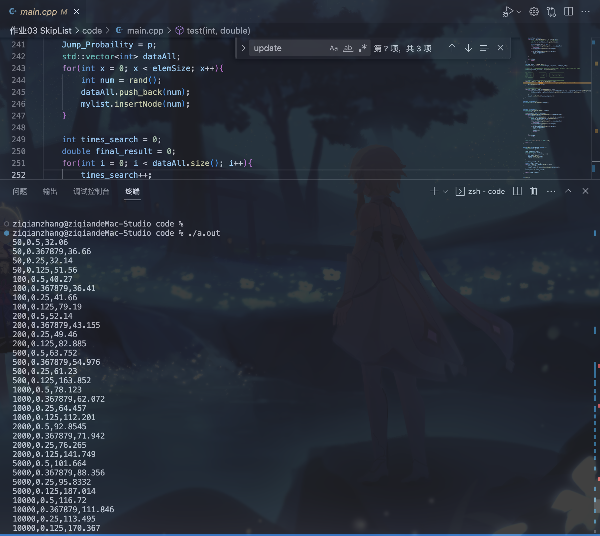

# SkipList 作业

> 本次作业中，你需自行实现一个跳表（仅需实现插入和查找操作），并探究增长率对跳表性能的影响。

#### 一、跳表代码解释和说明

##### 定义的类型：

首先，既然是跳表，那就离不开节点

- 节点需要区分首尾节点、还有中间的普通类型的数据节点
- 节点需要能够链接到后面的节点，而且因为考虑到层高，需要有一个可伸缩的容器存放指针
- 节点需要提供一些可以调用的函数，供外层的获取内部数值，或者修改数值
- 下面是我的一些函数设计

```c++
template <typename T>
class node{
private:
    T value;
    int height;
    int nodeType;
    std::vector<node*> next;
    
public:
    node(T val,int level, int type){}
  
    int getHeight(){return next.size();}
  
    void updateHeight(){}
  
    int getNodeType(){return this->nodeType;}
  
    int setNextVec(node* pt_next, int index){}
  
    T getValue(){}
  
    node* getNextVec(int index){}
};
```

关于插入节点，其实最复杂的是插入完成之后，需要对于指针的修改是最繁琐的。我这里介绍一下我的逻辑实现：

- 首先需要一个搜索指针`pt`，指向头部的节点，然后逐渐移动这指针到需要插入数据的位置的前面的一个节点
- 检查这个指针指向的节点，从最高的那一层楼开始往下找，如果找到某一层的下一个节点的数值比我们要找的目标target数值小，那就说明可以跳动过去。
- 跳动过去之后，相当于就又要重新上面的步骤了，从最高的一层开始找
- 如果从最高的一层往下找，找到了最底层都没跳动，那就是说明指针已经移动到了正确的位置，继续
- 接下来我们还需要两个指针，一个指针用来创建新的节点，一个指针用来指向刚刚`pt`指向节点的后面一个，因为如果你不把后面的节点抓住，一旦修改前面的指针，那后面的东西就永远的找到了。这也是链表里面一样的思想。
- 接下来，需要更新pt指向的节点里面的所有楼的next指针。
  - 更新规则是：低于新创建节点的楼层的指针，全部指向新创建的节点
  - 更高楼层的指针，往后面指向正确的位置
- 然后，再更新新创建的节点的里面的所有楼层的next指针。
  - 更新规则：向后面查找到最近的对应的一个节点的楼层位置即可
- 具体的实现代码如下：

```cpp
template <typename T>
void skipList<T>::insertNode(T target){
    node<T>* pt = this -> listhead;
    while(pt->getNextVec(0)->getNodeType() != nodeType_End){
        bool ifJump = false;
        for(int i = pt->getHeight() - 1; i >= 0; i--){
            //std::cout  << "for  " << i << std::endl;
            node<T>* curLevelNext = pt->getNextVec(i);

            assert(curLevelNext != NULL);
            if(curLevelNext->getNodeType() == nodeType_End)
                continue;
            if(curLevelNext->getValue() == target)
                return;
            if(curLevelNext->getValue() < target){
                pt = curLevelNext;
                ifJump = true;
            }
        }

        if(!ifJump)
            break;
    }

    int new_level = random_level();
    node<T>* new_pt = new node<T>(target, new_level, nodeType_Node);

    // pt 是经过搜索的得到的目标指针，因为涉及到链表断开重链接，所以必须把两头都拿好！
    node<T>* pt_next_original = pt->getNextVec(0);

    //  --------         ----------      ---------------------
    // |        |       |          |    |                     | 
    // |   pt   |   ->  |  new_pt  | -> |   pt_next_original  |
    // |        |       |          |    |                     |
    //  --------          --------       ---------------------

    // 更新上一个节点的vec数组，不同楼层的指针需要更新到合适的
    for(int i = 0; i < new_pt -> getHeight(); i++){
        //std::cout << "update" << i << " " << new_pt->getHeight() << std::endl;
        pt->setNextVec(new_pt, i);
    }

    // 更新新的节点的vec数组
    for(int i = 0; i < new_pt->getHeight(); i++){
        while(pt_next_original->getNodeType() !=nodeType_End && i + 1 > pt_next_original->getHeight()){
            pt_next_original = pt_next_original->getNextVec(pt_next_original->getHeight() - 1);
            
        }
        new_pt->setNextVec(pt_next_original, i);
    }
}
```

关于查找节点，我们其实已经在插入节点的里面我们已经做了一个简单的搜索功能，搜索的规则是：

- 首先从头节点开始，从最高楼层开始，看后面有没有已经链接上来的节点
- 如果有，和目标比较，如果找到了，那就可以返回了
- 如果比目标要找的还大，那就暂且不管，继续下楼
- 如果比目标小，那就一跳过去。
- 如果下楼到了一楼，没有跳，那一定是没有这个节点
- 以上的相关操作，每一步都需要记录行走的步数，以便于返回结果统计

```cpp
template <typename T>
int skipList<T>::SearchLength(T target){
    int result = 0;
    node<T>* pt = this -> listhead;
    while(pt->getNextVec(0)->getNodeType() != nodeType_End){
        bool ifJump = false;
        for(int i = pt->getHeight() - 1; i >= 0; i--,result++){
            node<T>* curLevelNext = pt->getNextVec(i);
            assert(curLevelNext != NULL);
            if(curLevelNext->getNodeType() == nodeType_End)
                continue;
            if(curLevelNext->getValue() == target)
                return result + 1;
            if(curLevelNext->getValue() < target){
                pt = curLevelNext;
                ifJump = true;
                result+=2;
                break;
            }
        }
        if(!ifJump)
            break;
    }

    std::cout <<"no found" << std:: endl; 
    return -1;
}
```

#### 二、如何设计测试用例

为了让每一次的测试实现抽象，我编写了这个函数，接收跳表的大小（多少个元素），p（层数增长的概率）然后进行测试，测试的逻辑是：

- 首先把相关的变量值设置：例如把全局变量的p值设置
- 然后产生随机数字，放到data的容器里面，这样便于后面查找
- 接下来开始往跳表里面插入数据
- 插入完成之后，根据设计的data容器里面的值，取对应的跳表里面查找数据
- 查找函数会直接返回经过的路径。
- 根据返回的结果，计算平均值，返回给调用的main函数。

```C++
double test(int elemSize, double p){
    skipList<int> mylist;

    Jump_Probaility = p;
    std::vector<int> dataAll;
    for(int x = 0; x < elemSize; x++){
        int num = rand();
        dataAll.push_back(num);
        mylist.insertNode(num);
    }

    int times_search = 0;
    double final_result = 0;
    for(int i = 0; i < dataAll.size(); i++){
        times_search++;
        final_result += mylist.SearchLength(dataAll[i]);
    }
    final_result /= times_search;

    return final_result;
}
```

#### 三、作图和分析

程序运行的结果如下，把获取到的数据放在一个csv文件里面，然后用Excel作图：



画图结果如下，解释说明：

- 这个图里面有三个坐标轴，向右边的是概率p，其中那个0.36的是$1/e$，向纸里面的那个轴是n的大小，其实也已经标明了，z轴是平均的搜索的路线的长度。
- 首先，随着n的增大，显然是搜索的路线的长度在整体上是要变大的，因为整个链表边长了，在楼层增长概率一定的前提下，搜索的长度肯定是要变长的
- 然后，随着p的增大，关系比较微妙：就是搜索的平均路线长度出现一个先递减的趋势，然后再递增，我推测这里$1/e$的这里是一个极值点，后面证明。
- 当然，因为数据量比较小的时候，可能会出现一些意想不到的偶然性情况，所以在$n=50$，的时候，也不是严格的成立，但是随着数据量增大，一些规律也变得越来越明显！


我们课堂上提到过$L(n)=log_{1/p}n$，代表最大能达到的层数，也证明了搜索的时间复杂度$C(k) = k/p$，综合一下
$$
C(p)= \frac{ln(n)}{-pln(p)}
$$
解释一下为什么有一个符号，因为p的概率是0-1，显然整体的时间是正的，有一个符号也很正常。我们对于函数
$$
H(x)=xln(x)
$$
求导的结果：$H^{'}(x)=ln(x)+1$，在$(0,\frac{1}{e}]$单调递减，$[\frac{1}{e},+无穷]$单调递增，这也是一致的和上图。所以证明完毕。


