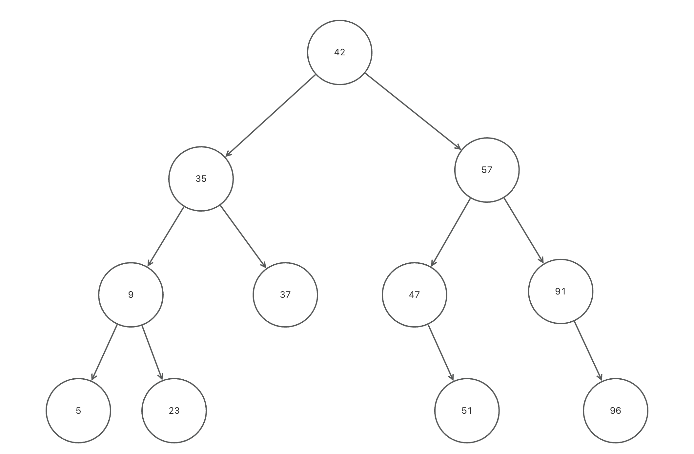
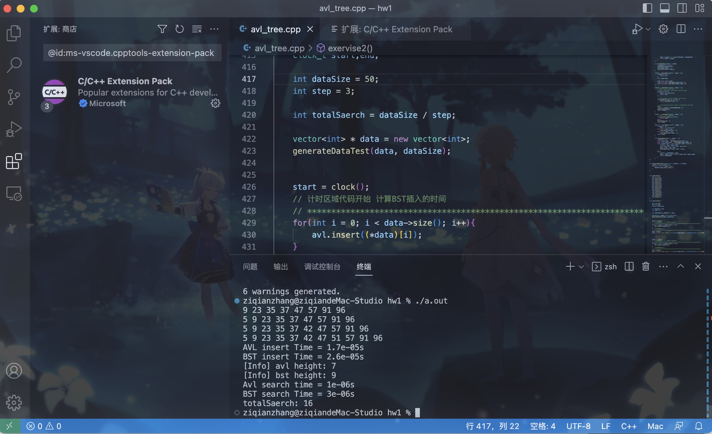
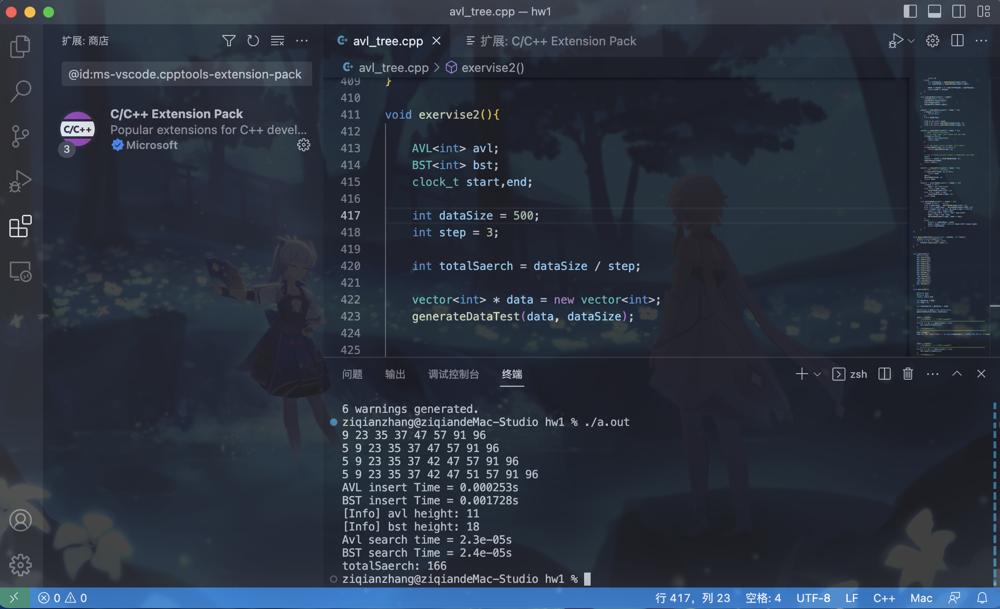

# Homework 1 AVL vs BST:

### Exercise 1



### Exercise 2

> 这部分是对比两个Avi和BST Tree的性能，基本的插入算法、删除算法参考数据结构课程的内容。由于原始的模板中，似乎出现了错误的函数签名`node * rightRotation(node * head)`, 而使用模板应该要`node<T> * rightRotation(node<T> * head)`才能正常运行，所以我做了适度的修改。

关于插入节点，核心算法是递归，具体插入节点之后的调整有四种情况，RR、RL、LL、LR，根据不同的情况旋转节点既可以完成AVL Tree。具体的实现代码如下。在实现过程中，我遇到的最大的一个Bug就是没有使用`&`引用传递，所以导致出现插入多个节点依然失效的问题。

#### InsertUtil 实现

- 首先检查根节点是否为NULL，如果为NULL说明是空树，插入节点
- 然后检查这个节点是否已经出现过，如果出现过就无需插入
- 如果是一个全新的节点，就插入，并且更新树的节点数目

```
        node<T> * insertUtil(node<T> * head, T x){
            // TODO: finish insertUtil
            // If no root node, just create one new node
            if(root == NULL){
                root = new node<T>(x);
                return root;
            }
            
            // If new node x exist already, just return
            if(searchUtil(root, x) != NULL) {
                return searchUtil(root, x);
            }
            
            // now we ensure we will insert a completely new node
            num++;
            return insertNode(head, x);
        }
```

#### removeUtil 实现

- 类比插入，如果存在这个节点就开始删除
- 如果不存在这个节点就不删除

```
        node<T> * removeUtil(node<T> * head, T x){
            // TODO: finish removeUtil
            // no exist node will be ignored
            if(searchUtil(root, x) != NULL){
                num--;
            }
            
            // this function use &, so will make head pointer to root or new root
            // so after that, just return head directly!
            deleteNode(head, x);
            return head;
        }
```

#### insertNode 实现

- 这个函数核心是递归，所以如果空节点就是说明到达了目标，要开始创建节点了
- 如果x和当前节点有差异，根据大小关系，递归到合适的位置然后继续比较
- 根据数据结构课程的内容，执行LL、LR、RL、RR的插入即可
- 具体的LL、LR、RL、RR我就不多解释了

```
				node<T> * insertNode(node<T> * &head, T x){
            if(head == NULL){
                head = new node<T>(x);
            }
            else if(x < head->key){
                insertNode(head->left, x);
                if(height(head->left) - height(head->right) ==2){
                    if(x < head->left->key)
                        LL(head);
                    else
                        LR(head);
                }
            }
            else if(x > head->key){
                insertNode(head->right, x);
                if(height(head->right) - height(head->left) == 2){
                    if(x > head->right->key)
                        RR(head);
                    else
                        RL(head);
                }
            }

            head->height = 1 + max(height(head->left), height(head->right));
            return head;
        }
```

#### 完整代码

```cpp
// stu_name: zhangziqian
// stu_ID: 520111910121
// Date: 2023-2-17

// Note: According to rules of template, there seems to be somethings wrong with function signatre, so I made some changes as follows:
// ORIGINAL node * rightRotation(node * head).
// Now      node<T> * rightRotation(node<T> * head).

#include<iostream>
#include<vector>
#include <stdlib.h>
#include <time.h> 

using namespace std;

template <typename T>
class node{
    public:
        T key;
        int height;
        node * left;
        node * right;
        node(T k){
            height = 1;
            key = k;
            left = NULL;
            right = NULL;
        }
};

template <typename T>
class AVL{
    public:
        node<T> * root = NULL;
        int num = 0;

        void insert(T x){
            root=insertUtil(root, x);
        }

        void remove(T x){
            root=removeUtil(root, x);
        }

        node<T> * search(T x){
            return searchUtil(root,x);
        }

        void inorder(){
            inorderUtil(root);
            cout<<endl;
        }
    
        int getTreeHeight(){
            return height(root);
        }

    private:
        int height(node<T> * head){
            if(head==NULL) return 0;
            return head->height;
        }

        node<T> * rightRotation(node<T> * head){
            node<T> * newhead = head->left;
            head->left = newhead->right;
            newhead->right = head;
            head->height = 1+max(height(head->left), height(head->right));
            newhead->height = 1+max(height(newhead->left), height(newhead->right));
            return newhead;
        }

        node<T> * leftRotation(node<T> * head){
            node<T> * newhead = head->right;
            head->right = newhead->left;
            newhead->left = head;
            head->height = 1+max(height(head->left), height(head->right));
            newhead->height = 1+max(height(newhead->left), height(newhead->right));
            return newhead;
        }

        // Traverse and print AVL tree
        void inorderUtil(node<T> * head){
            if(head==NULL) return ;
            inorderUtil(head->left);
            cout<<head->key<<" ";
            inorderUtil(head->right);
        }

        node<T> * insertUtil(node<T> * head, T x){
            // TODO: finish insertUtil
            // If no root node, just create one new node
            if(root == NULL){
                root = new node<T>(x);
                return root;
            }
            
            // If new node x exist already, just return
            if(searchUtil(root, x) != NULL) {
                return searchUtil(root, x);
            }
            
            // now we ensure we will insert a completely new node
            num++;
            return insertNode(head, x);
        }

        node<T> * removeUtil(node<T> * head, T x){
            // TODO: finish removeUtil
            // no exist node will be ignored
            if(searchUtil(root, x) != NULL){
                num--;
            }
            
            // this function use &, so will make head pointer to root or new root
            // so after that, just return head directly!
            deleteNode(head, x);
            return head;
        }

        node<T> * searchUtil(node<T> * head, T x){
            if(head == NULL) {
                return NULL;
            };
            T k = head->key;
            
            if(k == x) return head;
            if(k > x) return searchUtil(head->left, x);
            if(k < x) return searchUtil(head->right, x);
        }

        // ************************************************************************
        //                              工具函数区域
        // ************************************************************************

        node<T> * insertNode(node<T> * &head, T x){
            if(head == NULL){
                head = new node<T>(x);
            }
            else if(x < head->key){
                insertNode(head->left, x);
                if(height(head->left) - height(head->right) ==2){
                    if(x < head->left->key)
                        LL(head);
                    else
                        LR(head);
                }
            }
            else if(x > head->key){
                insertNode(head->right, x);
                if(height(head->right) - height(head->left) == 2){
                    if(x > head->right->key)
                        RR(head);
                    else
                        RL(head);
                }
            }

            head->height = 1 + max(height(head->left), height(head->right));
            return head;
        }

        // Based on leftRotation and rightRotation, build these function!
        void RR(node<T> * & head){
            head = leftRotation(head);
        }
        void RL(node<T> * & head){
            head->right = rightRotation(head->right);
            head = leftRotation(head);
        }
        void LR(node<T> * & head){
            head->left = leftRotation(head -> left);
            head = rightRotation(head);
        }
        void LL(node<T> * & head){
            head = rightRotation(head);
        }

        bool deleteNode(node<T> * &head, T x){
            if(head == NULL)
                return true;
            if(x == head -> key){
                // deleted node is leaf node or has only one child
                if(head -> left == NULL || head -> right == NULL){
                    node<T> * oldNode = head;
                    head = (head ->left != NULL)? head ->left: head->right;
                    delete oldNode;
                    return false;
                }
                // deleted node has two children
                else{ 
                    // Data Structure Page 271, exchange the min value of right tree with head root node
                    // And then delete the node(has the min value of the right tree) 
                    node<T> * tmp = head ->right;
                    while(tmp->left != NULL) tmp = tmp ->left;
                    head->key = tmp ->key;
                    if(deleteNode(head -> right ,tmp->key))
                        return true;
                    return adjust(head, 1);
                }
            }
            // delete on left child tree
            else if(x < head -> key){
                if(deleteNode(head ->left, x))
                    return true;
                else   
                    return adjust(head , 0);
            }
            // delete on right child tree
            else if(x > head -> key){
                if(deleteNode(head ->right, x))
                    return true;
                else   
                    return adjust(head , 0);
            }
        }

        bool adjust(node<T> * &head, int ifRightSubTree){
            // delete on right sub tree
            if(ifRightSubTree){
                if(height(head->left) - height(head->right) == 1)
                    return true;
                if(height(head->right) ==  height(head->left)){
                    --(head ->height);
                    return false;
                }
                if(height(head->left->right) > height(head->left->left)){
                    LR(head);
                    return false;
                }
                LL(head);
                if(height(head->right) == height(head->left))
                    return false;
                else
                    return true;
            }
            else{
                if(height(head->right) - height(head->left) == 1)
                    return true;
                if(height(head->right) ==  height(head->left)){
                    --(head ->height);
                    return false;
                }
                if(height(head->left->right) > height(head->left->left)){
                    RL(head);
                    return false;
                }
                RR(head);
                if(height(head->right) == height(head->left))
                    return false;
                else
                    return true;
            }
        }
};


template <typename T>
class BST{
    // TODO: finish BST according to AVL
    public:
        node<T> * root = NULL;
        int num = 0;

        void insert(T x){
            root=insertUtil(root, x);
        }

        void remove(T x){
            root=removeUtil(root, x);
        }

        node<T> * search(T x){
            return searchUtil(root,x);
        }

        void inorder(){
            inorderUtil(root);
            cout<<endl;
        }

        int getTreeHeight(){
            return height(root);
        }

    private:
        int height(node<T> * head){
            if(head==NULL) return 0;
            return head->height;
        }

        int updateHeight(node<T> * head){
            if(head == NULL)
                return 0;
            else{
                int leftHeight = updateHeight(head->left);
                int rightHeight = updateHeight(head->right);

                head -> height = 1 + max(leftHeight, rightHeight);
                return head -> height;
            }
        }

        void inorderUtil(node<T> * head){
            if(head==NULL) return ;
            inorderUtil(head->left);
            cout<<head->key<<" ";
            inorderUtil(head->right);
        }

        node<T> * searchUtil(node<T> * head, T x){
            if(head == NULL) {
                return NULL;
            };
            T k = head->key;
            
            if(k == x) return head;
            if(k > x) return searchUtil(head->left, x);
            if(k < x) return searchUtil(head->right, x);
        }

        node<T> * insertUtil(node<T> * head, T x){
            // TODO: finish insertUtil
            // If no root node, just create one new node
            if(root == NULL){
                root = new node<T>(x);
                return root;
            }
            
            // If new node x exist already, just return
            if(searchUtil(root, x) != NULL) {
                return searchUtil(root, x);
            }
            
            // now we ensure we will insert a completely new node
            num++;
            node<T> * result = insertNode(head, x);
            updateHeight(head);
            return result;
        }

        node<T> * removeUtil(node<T> * head, T x){
            // TODO: finish removeUtil
            if(searchUtil(head, x) == NULL)
                return head;
            num--;
            deleteNode(head, x);
            return head;
        }
        node<T> * insertNode(node<T> * &head, T x){
            if(head == NULL)
                head = new node<T>(x);
            else if(x < head ->key)
                insertNode(head->left ,x);
            else if(x > head -> key)
                insertNode(head->right, x);
            return head;
        }

        void deleteNode(node<T> * &head, T x){
            if(head == NULL)   return;
            if(x < head->key)   deleteNode(head->left, x);
            else if(x > head->key)   deleteNode(head->right, x);
            else if(head->left != NULL && head->right != NULL){
                node<T> * tmp = head->right;
                while(tmp->left !=NULL) tmp = tmp->left;
                head -> key = tmp ->key;
                deleteNode(head->right, head -> key);
            }
            else{
                node<T> * tmpOldNode = head;
                head = (head ->left !=NULL)? head->left: head->right;
                delete tmpOldNode;
            }
        }
};


void generateDataTest(vector<int> * dataVec, int times){
    srand((unsigned)time(NULL));
    for(int i = 0; i < times; i++){
        dataVec->push_back( rand() );
    }
}


void exervise1(){
    AVL<int> avl;
    avl.insert(9);
    avl.insert(23);
    avl.insert(35);
    avl.insert(57);
    avl.insert(47);
    avl.insert(91);
    avl.insert(37);
    avl.insert(96);
    avl.insert(5);
    avl.insert(42);
    avl.insert(51);
    avl.inorder();
}

void exervise2(){

    AVL<int> avl;
    BST<int> bst;
    clock_t start,end;

    int dataSize = 20000;
    int step = 3;

    int totalSaerch = dataSize / step; 

    vector<int> * data = new vector<int>;
    generateDataTest(data, dataSize);


    start = clock();
    // 计时区域代码开始 计算BST插入的时间
    // **********************************************************************
    for(int i = 0; i < data->size(); i++){
        avl.insert((*data)[i]);
    }
    // 计时区域代码结束
    // **********************************************************************
    end = clock();
    cout << "AVL insert Time = " << double(end-start) / CLOCKS_PER_SEC << "s"<<endl;
    


    start = clock();
    // 计时区域代码开始 计算BST插入的时间
    // **********************************************************************
    for(int i = 0; i < data->size(); i++){
        bst.insert((*data)[i]);
    }
    // 计时区域代码结束
    // **********************************************************************
    end = clock();
    cout << "BST insert Time = " << double(end-start) / CLOCKS_PER_SEC << "s"<<endl;


    // 高度获取
    cout << "[Info] avl height: " << avl.getTreeHeight() << endl;
    cout << "[Info] bst height: " << bst.getTreeHeight() << endl;


    // 搜索的过程我是用搜索部分的方法，因为产生的数据已经放在vec容器里面，直接遍历一下

    start = clock();
    // 计时区域代码开始 计算搜索AVL的时间
    // **********************************************************************
    for(int i = 0; i < data->size(); i+= step){
        avl.search((*data)[i]);
    }
    // 计时区域代码结束
    // **********************************************************************
    end = clock();
    cout << "Avl search time = " << double(end-start) / CLOCKS_PER_SEC << "s" << endl;


    start = clock();
    // 计时区域代码开始 计算搜索BST的时间
    // **********************************************************************
    for(int i = 0; i < data->size(); i+= step){
        bst.search((*data)[i]);
    }
    // 计时区域代码结束
    // **********************************************************************
    end = clock();
    cout << "BST search Time = " << double(end-start) / CLOCKS_PER_SEC<<"s"<<endl;
    cout << "totalSaerch: " << totalSaerch << endl;
}

int main(){
    exervise1();
		exervise2();
    return 0;
}
```

#### 实验结果

> 在我的参数设置里面还有一个变量叫做`step`，这个是什么意思呢？我产生数据的原理是用一个数组，往里面添加dataSize个随机数，然后从0开始遍历，每次的步长是 `step`，也就是依次查找第$0,step, step\times2, \cdots $个元素,以此类推。综合考虑，为了节约最终的搜索时间，也保证搜索的内容具有随机性，每次的数据生成和时间相关，搜索的仅仅是产生数据里面的一部分，且步长设置为3比较合理。（设置大了在数据量小的时候会出问题，反之设置小了搜索的时间大大增加）
>
> 补充：前面四行的输出是对应第一题的内容，可以忽略。

> 当我设置dataSize，也就是插入的数据量为50的时候，具体的结果如下1）所示。为保证数据的真实可信度，所有数据以截屏的方式展示，后面用表格汇总。**参考作业的Excel文件**

##### 1）dataSize = 50



##### 2）dataSize = 100

##### 

##### 3）dataSize = 500

##### 

##### 4）dataSize = 1000


##### 5）dataSize = 2000


#### 绘图结果

##### 1、插入时间

- 关于插入时间，可以看到BST随着数据量大增加，插入的时间都增长速率远远要高于AVL插入的速度
- 原因分析：因为AVL插入的时候会保证节点的左右子树高度差不会超过2，所以大大的优化了树的高度，不仅仅提高了搜索的性能，还提高了插入的性能。
- 其实最开始的时候我本来以为AVL插入的时候要调整树结构，会导致时间慢更多，实际上数据显示调整好树的高度后，节约的插入时间要比调整的时间要更多。


##### 2、树的高度

- 显然由于AVL在插入的时候会调整树的结构，保证树的高度会尽可能小，如下图所示


##### 3、平均单项搜索时间图

- 平均单项搜索时间：搜索总时间除以搜索的数量
- 从大体上来看，可以说明AVL的搜索性能比BST都要好。


