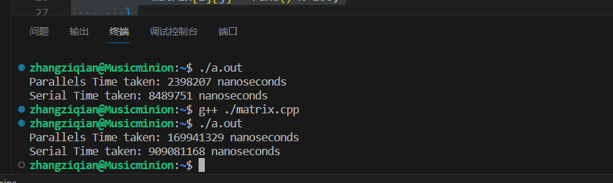

### Lab 3 

> 比较Worker死循环和Sleep的优劣

- 比较优缺点：前者的直接死循环浪费CPU资源，因为一直在运转。但是一旦有任务来了马上就可以响应
- 后者任务来了可能要经过信号的传递，可能反应慢了一点点，但是休息的时候节约CPU的资源。所以我们可能更多的时候采用后者这个方式


> 针对上面两个问题，说明如何进行任务划分

- 第一个任务其实细粒度的说就是要计算C矩阵的每一个元素的位点。对于

$$
C[i][j]= \sum_{k=0}^{k_{max}} A[i][k] * B[k][j]
$$

- 所以来说，我们所有的任务的数量就是C矩阵的行数*C矩阵的列数。当然我们也可以做一个适度的合并，比如每一个线程计算若干行若干列的结果，然后把一个大的矩阵分成若干块。毕竟如果一个矩阵有上万的行列，开上万的线程肯定是效果不好的。我们可以根据CPU的核心数量，把任务粒度适度缩放
- 然后，这些任务之间是没有任何依赖关系的，因为都是只读操作，所以也不涉及到依赖
- 第二个任务涉及到依赖。根据递推公式，第i行维度、第j列维度的元素是上一行第j、第j-1列的元素的和。所以就是说下一行元素的计算需要等待上一行的计算任务完成之后才可以。
- 所以第一组任务队列：计算f1行的所有的元素，
- 第二组任务的队列（必须等f1算完之后才可以），根据f1行的计算结果，计算f2行的
- 后面的以此类推。总之就是后面一行的要等到上一行的再算出来之后，才能计算？

> 但是真的要这样吗？

- 写完了之后我又再看了一眼。我发现整个矩阵就是一个二项展开嘛！
- $f[i][j] = C_{i-1}^{j-1}(0base,i>0,j>0)$
- 然后我们也知道，组合数的计算公式，所以这样就消除了前后的计算依赖关系！因为只要根据公式，就能推算出每个点的数据

| 1    | 0    | 0    | 0    | 0    | 0    | 0    | 0    | 0    | 0    |
| ---- | ---- | ---- | ---- | ---- | ---- | ---- | ---- | ---- | ---- |
| 0    | 1    | 0    | 0    | 0    | 0    | 0    | 0    | 0    | 0    |
| 0    | 1    | 1    | 0    | 0    | 0    | 0    | 0    | 0    | 0    |
| 0    | 1    | 2    | 1    | 0    | 0    | 0    | 0    | 0    | 0    |
| 0    | 1    | 3    | 3    | 1    | 0    | 0    | 0    | 0    | 0    |
| 0    | 1    | 4    | 6    | 4    | 1    | 0    | 0    | 0    | 0    |
| 0    | 1    | 5    | 10   | 10   | 5    | 1    | 0    | 0    | 0    |
| 0    | 1    | 6    | 15   | 20   | 15   | 6    | 1    | 0    | 0    |
| 0    | 1    | 7    | 21   | 35   | 35   | 21   | 7    | 1    | 0    |
| 0    | 1    | 8    | 28   | 56   | 70   | 56   | 28   | 8    | 1    |


> 问题二：有哪些应用场景

- 例如我们要求解一个图问题，这个图里面有很多节点、也有很多边。我需要计算每个节点可以到达的所有节点的最短距离。我可以从每个节点出发，用DFS或者BFS搜索最短的路径。那么每个节点就是一个任务，因为这个任务是只会读取图的，不会修改，所以就可以并行
- 并行矩阵的加法乘法，前面的例子也有了
- 例如要审查一个电影里面的所有的不良片段，我可以把视频切成若干个小块，然后分给不同的Worker。不同的Worker根据自己的算法来进行审查，这样就可以把整个大的任务变成小的。


> 问题三：写程序

- 并行的问题：给出一个矩阵A、B，计算A+B的结果
- 并行的方法就是开若干个线程，把矩阵按照行来切割。第一个线程做第0行到k行的，第二个线程做k+1到2k行的加法，以此类推。然后完成计算
- 程序的代码如下所示，比较并行和串行的加法操作
- 可以明显看到并行的要比串行速度快5倍以上（参数是8线程）



```cpp
#include <iostream>
#include <vector>
#include <thread>
#include <chrono>

#define MATRIX_SIZE 10000
#define NUM_THREADS 8

void matrixAddition(const std::vector<std::vector<int>>& matrixA, const std::vector<std::vector<int>>& matrixB, std::vector<std::vector<int>>& result, int startRow, int endRow)
{
    for (int i = startRow; i < endRow; i++)
    {
        for (int j = 0; j < MATRIX_SIZE; j++)
        {
            result[i][j] = matrixA[i][j] + matrixB[i][j];
        }
    }
}

void initData(std::vector<std::vector<int>>& matrix)
{
    for (int i = 0; i < MATRIX_SIZE; i++)
    {
        for (int j = 0; j < MATRIX_SIZE; j++)
        {
            matrix[i][j] = rand() % 100;
        }
    }
}

int main()
{
    std::vector<std::vector<int>> matrixA(MATRIX_SIZE, std::vector<int>(MATRIX_SIZE));
    std::vector<std::vector<int>> matrixB(MATRIX_SIZE, std::vector<int>(MATRIX_SIZE));
    std::vector<std::vector<int>> result(MATRIX_SIZE, std::vector<int>(MATRIX_SIZE));

    // 初始化矩阵 matrixA 和 matrixB
    initData(matrixA);
    initData(matrixB);

    

    // 创建线程并执行并行计算，同时记录开始时间
    auto start = std::chrono::high_resolution_clock::now();
    std::vector<std::thread> threads;
    int chunkSize = MATRIX_SIZE / NUM_THREADS;
    int startRow = 0;
    int endRow = chunkSize;

    for (int i = 0; i < NUM_THREADS; i++)
    {
        threads.emplace_back(matrixAddition, std::ref(matrixA), std::ref(matrixB), std::ref(result), startRow, endRow);
        startRow += chunkSize;
        endRow += chunkSize;
    }

    // 等待线程完成，同时记录结束时间
    for (auto& thread : threads)
    {
        thread.join();
    }
    auto end = std::chrono::high_resolution_clock::now();

    // // 输出结果矩阵
    // for (int i = 0; i < MATRIX_SIZE; i++)
    // {
    //     for (int j = 0; j < MATRIX_SIZE; j++)
    //     {
    //         std::cout << result[i][j] << " ";
    //     }
    //     std::cout << std::endl;
    // }

    // 计算并输出总时间
    auto duration = std::chrono::duration_cast<std::chrono::nanoseconds>(end - start);
    std::cout << "Parallels Time taken: " << duration.count() << " nanoseconds" << std::endl;


    // 串行计算
    start = std::chrono::high_resolution_clock::now();

    for (int i = 0; i < MATRIX_SIZE; i++)
    {
        for (int j = 0; j < MATRIX_SIZE; j++)
        {
            result[i][j] = matrixA[i][j] + matrixB[i][j];
        }
    }

    end = std::chrono::high_resolution_clock::now();

    // // 输出结果矩阵
    // for (int i = 0; i < MATRIX_SIZE; i++)
    // {
    //     for (int j = 0; j < MATRIX_SIZE; j++)
    //     {
    //         std::cout << result[i][j] << " ";
    //     }
    //     std::cout << std::endl;
    // }

    // 计算并输出总时间
    duration = std::chrono::duration_cast<std::chrono::nanoseconds>(end - start);
    std::cout << "Serial Time taken: " << duration.count() << " nanoseconds" << std::endl;

    return 0;
}

```

